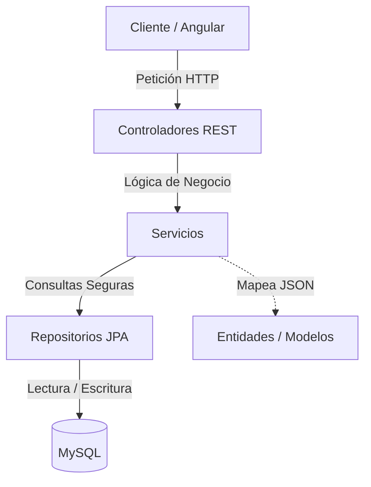

# 📁 Estructura Completa de Clases — La Gramola Virtual

Para que defiendas el proyecto con máxima seguridad, aquí tienes el **mapa de planos y piezas** de la aplicación. Te explica de forma sencilla y directa qué contiene cada clase, su papel en el sistema y qué métodos o datos guarda.

---

## 🏛️ PARTE 1: La Estructura de la Cocina (Backend - Spring Boot / Java)

El backend está organizado siguiendo la **arquitectura por capas estándar de la industria** (Controlador -> Servicio -> Repositorio -> Base de Datos).

---

### 1. Las Fichas del Almacén (Modelos / Entidades JPA - `models/`)
Son clases de Java que **mapean directamente a tablas físicas en tu base de datos MySQL**. Cada propiedad es una columna en MySQL.

*   #### 👤 [User.java](file:///c:/Users/34643/OneDrive%20-%20Universidad%20de%20Castilla-La%20Mancha/Escritorio/Gramola_Rodrigo_Simplificado/backend/src/main/java/com/gramola/backend/models/User.java) (Tabla: `users`)
    *   *Qué contiene:* La ficha del barman registrado.
    *   *Datos clave:*
        *   `barName`, `email`, `password` (Datos de la cuenta).
        *   `confirmed` y `confirmationToken` (Para saber si activó su correo por Mailtrap).
        *   `subscriptionActive` y `stripeCustomerId` (Para saber si pagó su cuota mensual en Stripe).
        *   `spotifyClientId`, `spotifyClientSecret` (Credenciales de su app de Spotify).
        *   `spotifyAccessToken`, `spotifyRefreshToken` (Las llaves de control de Spotify OAuth2).
        *   `songPriceCents` (El precio en céntimos que cobra a sus clientes por canción - **Requisito 3.2**).
        *   `currentPlaylistUri`, `lastPlaylistIndex` (Para recordar qué música sonaba si se va la luz).

*   #### 🎵 [QueueItem.java](file:///c:/Users/34643/OneDrive%20-%20Universidad%20de%20Castilla-La%20Mancha/Escritorio/Gramola_Rodrigo_Simplificado/backend/src/main/java/com/gramola/backend/models/QueueItem.java) (Tabla: `playback_queue`)
    *   *Qué contiene:* Una canción que está esperando físicamente en la cola activa del local.
    *   *Datos clave:*
        *   `bar` (A qué bar pertenece, enlazado al `User`).
        *   `title`, `artist`, `spotifyTrackId`, `albumArtUrl`, `durationMs` (Metadatos del tema).
        *   `position` (El número de orden en la lista: la 0 suena, la 1 se cuela, etc.).
        *   `isPaid` (Booleano: si es `true` es de pago en verde; si es `false` es de ambiente en gris).
        *   `addedAt` (Fecha y hora exacta. Si dos pagan a la vez, desempata la más antigua).

*   #### 📊 [BarSong.java](file:///c:/Users/34643/OneDrive%20-%20Universidad%20de%20Castilla-La%20Mancha/Escritorio/Gramola_Rodrigo_Simplificado/backend/src/main/java/com/gramola/backend/models/BarSong.java) (Tabla: `bar_songs`)
    *   *Qué contiene:* El histórico definitivo de canciones cobradas al barman.
    *   *Datos clave:*
        *   `bar` (El bar).
        *   `spotifyTrackId`, `title`, `artist` (Canción comprada).
        *   `playedAt` (Cuándo se cobró).
    *   *¿Para qué sirve?* Es tu **tabla contable**. Almacena de forma persistente cada canción pagada por tarjeta para que el dueño sepa cuánto ha facturado el local con la Gramola.

*   #### 💰 [SubscriptionPlan.java](file:///c:/Users/34643/OneDrive%20-%20Universidad%20de%20Castilla-La%20Mancha/Escritorio/Gramola_Rodrigo_Simplificado/backend/src/main/java/com/gramola/backend/models/SubscriptionPlan.java) (Tabla: `subscription_plans`)
    *   *Qué contiene:* Las ofertas mensuales/anuales disponibles para el bar.
    *   *Datos clave:*
        *   `name` (Plan Mensual, Plan Semestral, Plan Anual).
        *   `priceCents` (Precio en céntimos para Stripe: 999 son 9,99€).
        *   `durationMonths` (Meses de servicio: 1, 6 o 12).
        *   `stripePriceId` (El código de tarifa oficial del Dashboard de Stripe).

*   #### 🔧 [SystemConfig.java](file:///c:/Users/34643/OneDrive%20-%20Universidad%20de%20Castilla-La%20Mancha/Escritorio/Gramola_Rodrigo_Simplificado/backend/src/main/java/com/gramola/backend/models/SystemConfig.java) (Tabla: `system_config`)
    *   *Qué contiene:* Las variables dinámicas de red en base de datos.
    *   *Datos clave:*
        *   `key` (La clave: ej: `frontend_url`).
        *   `value` (La dirección real: ej: `http://localhost:4200`).

*   #### 🔑 [SpotiToken.java](file:///c:/Users/34643/OneDrive%20-%20Universidad%20de%20Castilla-La%20Mancha/Escritorio/Gramola_Rodrigo_Simplificado/backend/src/main/java/com/gramola/backend/models/SpotiToken.java) (Modelo Auxiliar)
    *   *Qué contiene:* Clase simple sin base de datos que sirve únicamente para parsear las llaves que nos devuelve Spotify en JSON (`access_token`, `refresh_token`, `expires_in`).

---

### 2. Los Carteros del Almacén (Repositorios JPA - `repositories/`)
Son interfaces que heredan de `JpaRepository`. **No tienen código dentro**. Spring Boot las implementa por detrás. Actúan como los "carteros" que ejecutan sentencias SQL (`SELECT`, `INSERT`, `UPDATE`, `DELETE`) en MySQL con una sola línea en Java.
*   `UserRepository`: Busca barmans en MySQL (`findByEmail`, `findByConfirmationToken`, `findByResetPasswordToken`).
*   `QueueRepository`: Gestiona la cola física de MySQL (`findByBarOrderByPositionAsc`).
*   `BarSongRepository`: Inserta y lee el historial contable de MySQL.
*   `SubscriptionPlanRepository` y `SystemConfigRepository`: Recuperan planes y variables de red.

---

### 3. Los Cocineros (Capa de Negocio - Servicios - `services/`)
Aquí es donde reside **toda la lógica, fórmulas matemáticas e integraciones del sistema**.

*   #### 🛠️ [UserService.java](file:///c:/Users/34643/OneDrive%20-%20Universidad%20de%20Castilla-La%20Mancha/Escritorio/Gramola_Rodrigo_Simplificado/backend/src/main/java/com/gramola/backend/services/UserService.java)
    *   *Propósito:* Gestionar las reglas de los barmans.
    *   *Métodos estrella:*
        *   `register()`: Aplica el borrado preventivo de cuentas huérfanas, crea el usuario y envía el correo con Mailtrap.
        *   `confirmAccount()`: Pone `confirmed=true` en base de datos al pulsar el enlace.
        *   `generateResetToken()` y `resetPasswordWithToken()`: Envían el enlace de recuperación y graban la nueva contraseña invalidando el token.
        *   `login()`: Compara email y clave.

*   #### 🎹 [QueueService.java](file:///c:/Users/34643/OneDrive%20-%20Universidad%20de%20Castilla-La%20Mancha/Escritorio/Gramola_Rodrigo_Simplificado/backend/src/main/java/com/gramola/backend/services/QueueService.java)
    *   *Propósito:* Manejar la cola de reproducción en MySQL.
    *   *Métodos estrella:*
        *   `loadPlaylistIntoQueue()`: Algoritmo de fondo. Purga la música de ambiente anterior, respeta las pagadas y coloca la nueva playlist al final.
        *   `addSongToQueue()`: **Algoritmo de prioridad.** Si es pagada (`isPaid=true`), desplaza el resto de temas (+1) en MySQL y se cuela en la posición 1. Si es pagada, también lo graba en el historial contable `bar_songs`.
        *   `removeFirstAndAdvance()`: Disparado al terminar el tema. Borra el de la posición 0 y desplaza todo (-1) en MySQL para que suene la siguiente.

*   #### 🟢 [SpotiService.java](file:///c:/Users/34643/OneDrive%20-%20Universidad%20de%20Castilla-La%20Mancha/Escritorio/Gramola_Rodrigo_Simplificado/backend/src/main/java/com/gramola/backend/services/SpotiService.java)
    *   *Propósito:* Interactuar de forma directa con la API oficial de Spotify.
    *   *Métodos estrella:*
        *   `getAuthorizationToken()`: Intercambio de OAuth2. Canjea el código temporal por tokens usando Basic Auth (Base64).
        *   `refreshToken()`: Consigue un access_token válido usando el refresh_token guardado de forma totalmente invisible para el barman.
        *   `searchTracks()`: Escapa caracteres y realiza la llamada GET `/v1/search` limitando a 10 resultados para optimizar rendimiento.

*   #### 💳 [StripeService.java](file:///c:/Users/34643/OneDrive%20-%20Universidad%20de%20Castilla-La%20Mancha/Escritorio/Gramola_Rodrigo_Simplificado/backend/src/main/java/com/gramola/backend/services/StripeService.java)
    *   *Propósito:* Crear pasarelas seguras y cobrar tarjetas con Stripe.
    *   *Métodos estrella:*
        *   `createSubscriptionSession()`: Genera la pasarela de Stripe Checkout para suscripción mensual del bar restringida únicamente a pagos con tarjeta.
        *   `createSongPaymentSession()`: Genera la pasarela de pago único para que los clientes paguen una canción individual. Codifica los metadatos de la canción en la URL de éxito de forma robusta.

*   #### 📧 [MailService.java](file:///c:/Users/34643/OneDrive%20-%20Universidad%20de%20Castilla-La%20Mancha/Escritorio/Gramola_Rodrigo_Simplificado/backend/src/main/java/com/gramola/backend/services/MailService.java)
    *   *Propósito:* Redactar y enviar correos de texto plano con los tokens únicos mediante protocolo SMTP a Mailtrap.

---

### 4. Los Camareros (API REST - Controladores - `controllers/`)
Reciben las peticiones HTTP del navegador (Angular) y devuelven respuestas HTTP. Son simples intermediarios que llaman a los Servicios.
*   `UserController`: `/users/register`, `/users/login`, `/users/forgot-password`, `/users/confirmToken/...`.
*   `MusicController`: `/api/music/search`, `/api/music/queue/add`, `/api/music/queue/finish` (avanza la cola al terminar la reproducción) y `/api/music/pay` (cobrar canción).
*   `SubscriptionController`: `/api/subscriptions/plans` y `/api/subscriptions/checkout`.
*   `WebhookController`: `/api/webhooks/stripe` -> Escucha a Stripe y activa la suscripción del barman asíncronamente ante fallos de conexión.

---

### 5. Configuración e Infraestructura (`config/`)
*   `SecurityConfig.java`: Deshabilita el CSRF por ser una API JSON, y configura las reglas del **CORS** para autorizar el tráfico entrante del puerto 4200 (Angular).
*   `DataInitializer.java`: Rellena MySQL con precios y variables de red en la primera ejecución.

---

## 🖥️ PARTE 2: La Estructura de la Sala (Frontend - Angular)

El frontend está programado con Angular de última generación. Usa **Standalone Components** (Componentes Autónomos) que no dependen de ningún módulo central pesado.

---

### 1. Las Pantallas Visuales (Componentes - `components/`)
Cada pantalla tiene un archivo `.ts` (lógica) y un archivo `.html` (vista con estilos CSS en `.css`).

*   #### 🎵 [MusicComponent.ts](file:///c:/Users/34643/OneDrive%20-%20Universidad%20de%20Castilla-La%20Mancha/Escritorio/Gramola_Rodrigo_Simplificado/gramolafe/src/app/components/music/music.component.ts)
    *   *Qué contiene:* El centro de mandos de la Gramola.
    *   *Lógica clave:*
        *   Carga dinámicamente el script de Spotify SDK en el navegador.
        *   **ngOnInit()**: Inicia la sesión del local, refresca claves y arranca el **Polling** reactivo cada 5 segundos para actualizar la cola visual.
        *   **registerPlayerListeners()**: Controla los eventos del reproductor de Spotify (play, pause, fin de pista). **Algoritmo de Hilo Continuo:** al terminar de sonar la canción (posición 0), llama asíncronamente a `/finish` en Spring Boot para avanzar MySQL y reproducir el nuevo puesto 0 de inmediato.
        *   `paySong()`: Abre el popup con Stripe Checkout.

*   #### 👤 [LoginComponent.ts](file:///c:/Users/34643/OneDrive%20-%20Universidad%20de%20Castilla-La%20Mancha/Escritorio/Gramola_Rodrigo_Simplificado/gramolafe/src/app/components/login/login.component.ts)
    *   *Qué contiene:* Acceso de los locales. Si las credenciales coinciden y la cuenta está confirmada y pagada, redirige al reproductor. Si es primer inicio, le manda proactivamente a Spotify OAuth2. Controla también la ventana emergente para solicitar recuperación de contraseña.

*   #### 📋 [RegisterComponent.ts](file:///c:/Users/34643/OneDrive%20-%20Universidad%20de%20Castilla-La%20Mancha/Escritorio/Gramola_Rodrigo_Simplificado/gramolafe/src/app/components/register/register.component.ts)
    *   *Qué contiene:* El alta de locales, recopilando el formulario y enviándolo a Spring Boot manejando errores de duplicados (409) o contraseñas incorrectas (406).

*   #### 💳 [SubscriptionComponent.ts](file:///c:/Users/34643/OneDrive%20-%20Universidad%20de%20Castilla-La%20Mancha/Escritorio/Gramola_Rodrigo_Simplificado/gramolafe/src/app/components/subscription/subscription.component.ts)
    *   *Qué contiene:* Pantalla que dibuja las ofertas mensuales leídas dinámicamente de MySQL y redirige al barman a Stripe Checkout tras pulsar "Elegir Plan".

*   #### 🎉 [PaymentSuccessComponent.ts](file:///c:/Users/34643/OneDrive%20-%20Universidad%20de%20Castilla-La%20Mancha/Escritorio/Gramola_Rodrigo_Simplificado/gramolafe/src/app/components/payment-success/payment-success.component.ts)
    *   *Qué contiene:* Pantalla intermedia de éxito de Stripe. 
    *   *Lógica estrella:* **postMessage.** Si es el pago de una canción desde la ventana popup del cliente, envía una notificación asíncrona a la pestaña de administración del bar y cierra el popup automáticamente, actualizando la lista verde en caliente sin parar el audio.

*   #### 📞 [CallBackComponent.ts](file:///c:/Users/34643/OneDrive%20-%20Universidad%20de%20Castilla-La%20Mancha/Escritorio/Gramola_Rodrigo_Simplificado/gramolafe/src/app/components/callback/callback.component.ts)
    *   *Qué contiene:* Interceptor OAuth2. Limpia los enlaces con `history.replaceState` por seguridad y manda el código de Spotify a Spring Boot.

*   #### 🛡️ [SafePipe.ts](file:///c:/Users/34643/OneDrive%20-%20Universidad%20de%20Castilla-La%20Mancha/Escritorio/Gramola_Rodrigo_Simplificado/gramolafe/src/app/pipes/safe.pipe.ts)
    *   *Qué contiene:* Filtro de sanidad HTML. Aplica `DomSanitizer.bypassSecurityTrustResourceUrl` para que Angular autorice la reproducción de muestras de música externas de Spotify en reproductores sin errores de XSS.

---

### 2. Mensajeros Frontend (Servicios Angular - `services/`)
Clases anotadas con `@Injectable` que sirven para hacer las peticiones HTTP y guardar estados compartidos.

*   `SpotiService`: Almacena el reproductor único de Spotify de todo el navegador (**Singleton**) para evitar race conditions y coordina el login OAuth2.
*   `UserService`: Dispara el registro, login y confirmación al controlador Java de usuarios.
*   `QueueService`: Dispara la lectura de la cola. Implementa el **Polling Reactivo** usando RxJS (`timer(0, 5000)` y `switchMap`), preguntando cada 5 segundos a Spring Boot.
*   `MusicService`: Lanza búsquedas, encolado ambiental y procesamiento del pago único del cliente.

---

## 🧪 PARTE 3: El Probador Funcional (Selenium - `SeleniumTest.java`)

Clase de prueba extrema JUnit 5 con Selenium WebDriver:

*   #### 🚀 [SeleniumTest.java](file:///c:/Users/34643/OneDrive%20-%20Universidad%20de%20Castilla-La%20Mancha/Escritorio/Gramola_Rodrigo_Simplificado/backend/src/test/java/com/gramola/backend/SeleniumTest.java)
    *   *Qué contiene:* Un simulador robotizado visible de extremo a extremo.
    *   *Lógica clave:*
        *   Abre Chrome real en modo **visible** ante el tribunal (`--start-maximized`).
        *   Limpia la base de datos MySQL por completo (`limpiarBaseDeDatos()`) antes de arrancar.
        *   Loguea al barman simulado escribiendo credenciales automáticas.
        *   Busca la canción `"Despacito"` de forma robotizada en el buscador.
        *   Pulsar "Pagar", rellena la tarjeta de prueba virtual (`4242...`) y confirma el pago de Stripe.
        *   **Comprobación SQL directa (`verificarEnBaseDeDatos()`):** Hace un `SELECT` en `playback_queue` y en `bar_songs` en MySQL y valida mediante `assertTrue` que la canción cobrada se inyectó en ambas tablas con total integridad.

---

Con este mapa general, ¡tienes la estructura de clases completamente dominada para cualquier pregunta de arquitectura que te haga el tribunal! 🚀
